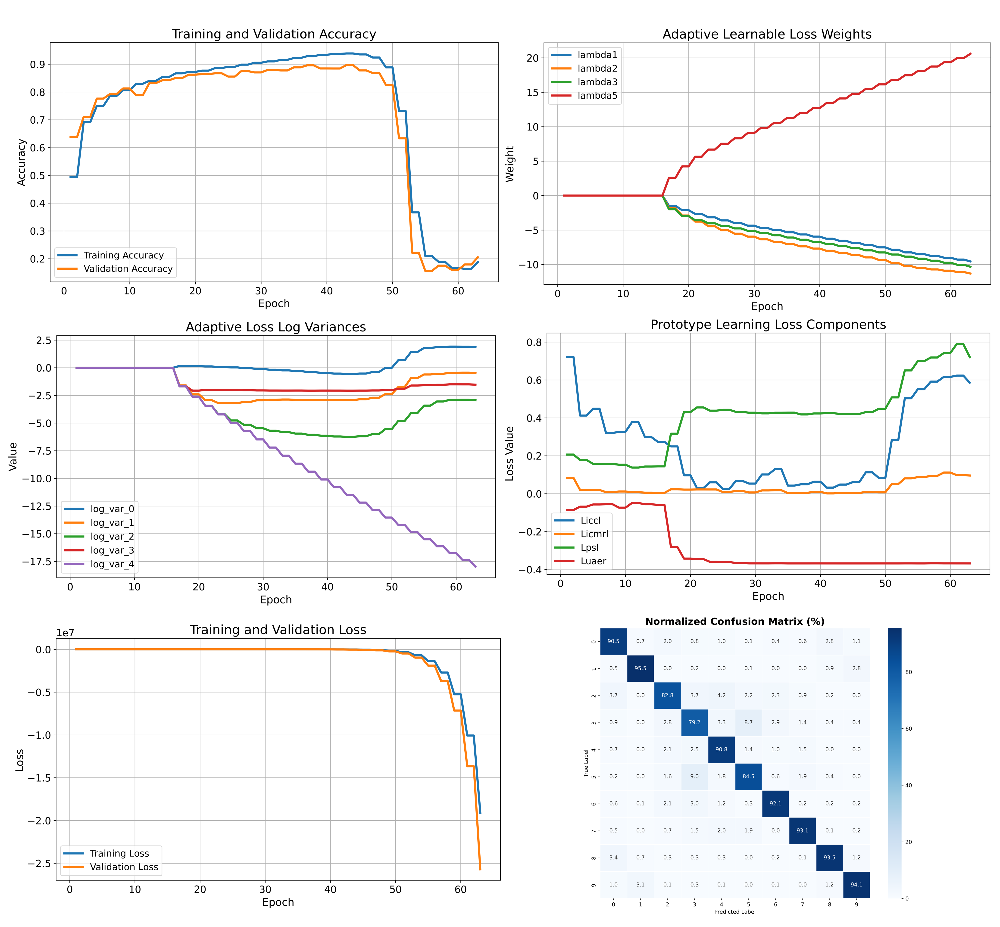
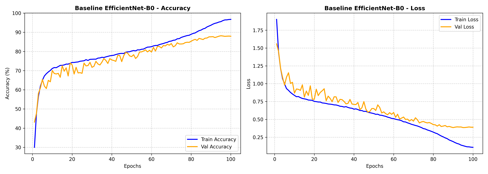
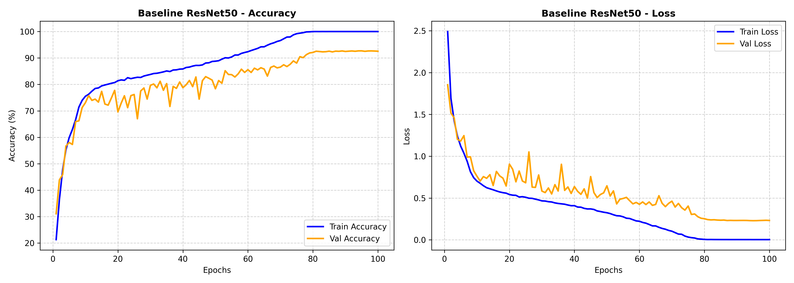

<h3 align="left">
  
    <b>Kết quả đánh giá trên các tập dữ liệu khác nhau</b>
  
</h3>

  <mark><b>Kết quả huấn luyện trên tập CIFAR-10</b></mark> so sánh giữa APNet-EML với các baseline EfficientNetB0 và ResNe50

  
   
  <i> Quá trình huấn luyện thử nghiệm mô hình <mark><b>APNet-EML</b></mark> trên tập dữ liệuCIFAR10, kích thước ảnh 64x64</i> 

  
   
  <i> Quá trình huấn luyện thử nghiệm mô hình <mark><b>Efficientnetb0</b></mark> trên tập dữ liệuCIFAR10, kích thước ảnh 64x64</i>

  
   
  <i> Quá trình huấn luyện thử nghiệm mô hình <mark><b>ResNet-50</b></mark> trên tập dữ liệuCIFAR10, kích thước ảnh 224x224</i>

  <mark><b>Kết quả huấn luyện trên tập Bảo tàng quân khu 9 - Cần Thơ</b></mark> so sánh các chiến lược huấn luyện để đánh giá mức độ ảnh hưởng giữa các thành phần được đề xuất và so sánh với các baseline models

  
   
  <i>  Độ chính xác giữa các mô hình Baseline so sánh APNet cùng với các chiến lược huấn luyện khác nhau trên tập <mark><b> dữ liệu bảo tàng quân khu 9</b></mark></i>

