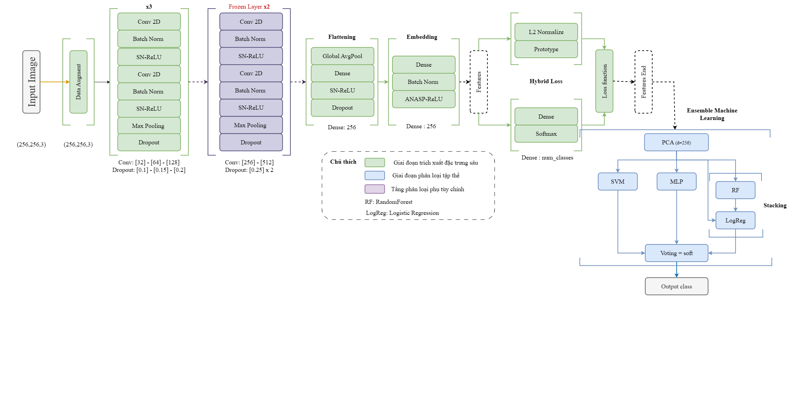
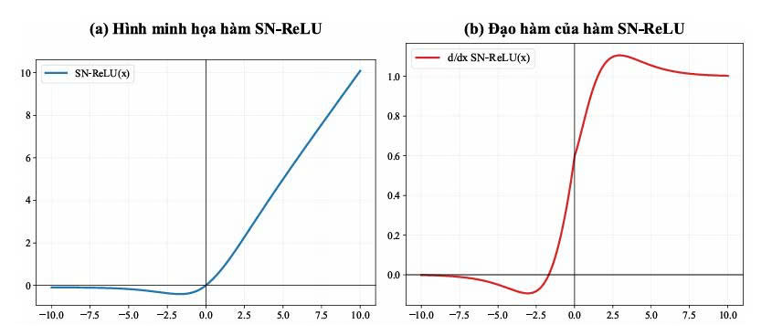
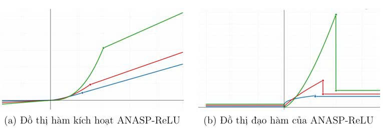
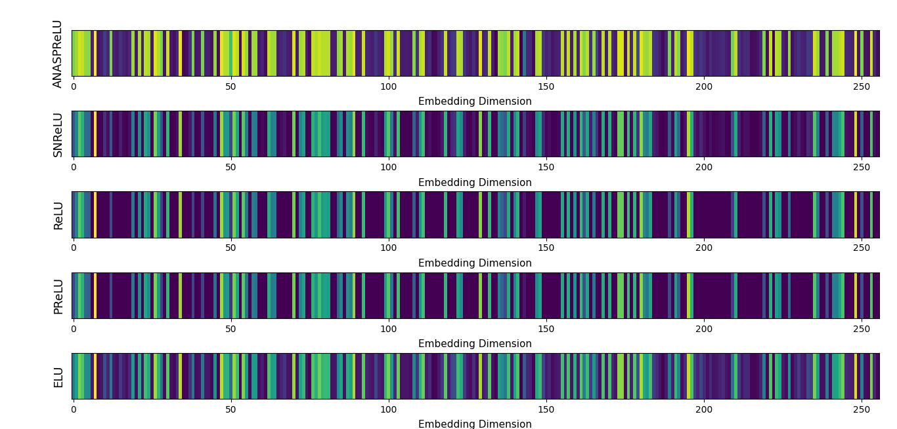

<h2 align="center">
  
    <b>Mô hình phân loại 2 giai đoạn APNet-EML (Adaptive Preservation Network - Ensemble Machine Learning)</b>
  
</h2>

<i>
Mô hình APNet-EML gồm 2 giai đoạn: Giai đoạn 1 trích xuất đặc trưng sâu qua APNetCNN được xây dựng dựa trên sự bảo toàn lưu lượng thông tin qua các tầng Conv bằng 2 hàm kích hoạt đề xuất là SNReLU (Smooth Nonlinear ReLU), ANASPReLU (Antique-Aware Soft-Preserving Rectified Linear Unit), kết hợp cùng hàm mất mát đa giai đoạn kích hoạt PD-Loss (Proposed Dynamic Loss) dựa trên Cross Entropy Loss, Artifact Structure Preservation Loss, Inter-Class Margin Ranking Loss, Intra-Class Compactness Loss, Prototype Separation Loss, Uncertainty-Aware Entropy Regularization. Nhờ ưu điểm của hàm kích hoạt và quá trình phân tách đặc trưng tối ưu của hàm mất mát nên mô hình giảm được các tầng Full Connection dày đặc vốn là đặc trưng của các mô hình truyền thống, do đó giảm số lượng parameters hơn 90% so với ResNet50. Giai đoạn 2 phân loại tập thể được thiết kế dựa trên sự suy giảm bias từ 4 họ mô hình máy học truyền thống SVM, Random Forest, Logistic Regression và MLP. Kết quả cho thấy mô hình đạt độ chính xác gần 90% trên tập CIFAR-10 với chưa tới 1M tham số.
</i>

  
   
  <i>Kiến trúc mô hình APNet-EML</i>

<b>A. Cấu trúc APNetCNN - trích xuất đặc trưng sâu</b>

Chúng tôi đề xuất một kiến trúc mạng nơ-ron tích chập tinh gọn được tối ưu hóa cho nhiệm vụ trích xuất và biến đổi không gian nhúng biểu diễn. Cơ chế hoạt động bao gồm ba giai đoạn xử lý chính: (1) Ảnh đầu vào sau bước tăng cường dữ liệu được đưa qua ba khối Conv2D nông với số kênh lần lượt 32 → 64 → 128 nhằm học các đặc trưng hình học cơ sở như biên, góc và kết cấu; (2) Bản đồ đặc trưng hai chiều được nén trực tiếp thành vectơ một chiều thông qua tầng Global Average Pooling (GAP), loại bỏ hoàn toàn các tầng Fully Connected truyền thống vốn chiếm phần lớn số lượng tham số trong mạng CNN; (3) Vectơ đặc trưng tiếp tục được tinh chỉnh qua hai tầng Dense gồm 256 nút để sinh ra vectơ nhúng biểu diễn đặc trưng có khả năng phân tách hình học tối đa z ∈ R256.

Bản chất của việc phân bổ phân cấp hai hàm kích hoạt phi tuyến SN-ReLU và ANASP-ReLU xuất phát từ sự khác biệt về vai trò toán học và chi phí tính toán tại từng độ sâu của kiến trúc mạng:

<i>(1) SN-ReLU tại các tầng trích xuất đặc trưng đầu:</i> Các tầng Conv2D nông xử lý bản đồ đặc trưng hai chiều có kích thước lớn (H × W × C). SN-ReLU kết hợp đặc tính phi tuyến trơn với thành phần rò rỉ âm nhỏ, giúp duy trì luồng đạo hàm liên tục trong quá trình lan truyền ngược, từ đó hạn chế hiện tượng mất gradient khi học các đặc trưng hình học mức thấp.

<i>(2) ANASP-ReLU tại tầng Dense 256 cuối:</i> Sau khi bản đồ đặc trưng được nén thành vectơ nhúng 256 chiều, ANASP-ReLU được sử dụng để tinh chỉnh không gian biểu diễn. Với ba vùng kích hoạt riêng biệt (miền âm nhẹ, miền phi tuyến và miền tuyến tính), hàm kích hoạt này đóng vai trò như một cơ chế biến đổi manifold thích nghi, giúp nén các chiều chứa thông tin dư thừa, đồng thời mở rộng khoảng cách giữa các đặc trưng mang tính phân biệt cao, từ đó nâng cao khả năng phân tách của vectơ nhúng trước giai đoạn phân lớp.

Để tăng cường khả năng phân tách của không gian nhúng 256 chiều, kiến trúc áp dụng cơ chế huấn luyện hai giai đoạn thông qua PD-Loss. Cơ chế này giúp thu hẹp khoảng cách giữa các mẫu cùng lớp quanh tâm đại diện (Prototype), đồng thời mở rộng khoảng cách giữa các lớp khác nhau và giảm ảnh hưởng của các mẫu khó (hard examples), từ đó hình thành không gian nhúng có tính phân biệt cao.

<b>B. Cấu trúc phân loại tập thể EML</b>

Tầng phân loại cuối được thiết kế theo cơ chế học tập thể (Ensemble Learning) dựa trên chiến lược Soft Voting bao gồm bốn bộ phân loại học máy gồm Support Vector Machine (SVM), Random Forest (RF), Logistic Regression (LogReg) và Multi-Layer Perceptron (MLP). Thiết kế này không phát sinh quá trình lan truyền ngược tại giai đoạn phân loại, qua đó duy trì tổng số tham số huấn luyện của toàn bộ mô hình ở mức tối ưu.

Ở cơ chế phân loại cuối Ensemble này có kết hợp cơ chế Stacking hai tầng giữa Random Forest và Logistic Regression, trong đó RF đóng vai trò bộ học cơ sở tạo ra các phân phối xác suất ban đầu, còn LogReg thực hiện hiệu chỉnh xác suất trước khi đưa vào cơ chế bỏ phiếu mềm. Nhờ vậy, các ranh giới quyết định dạng phân mảnh đặc trưng của tập hợp cây được làm mượt, giảm hiện tượng dự đoán quá tự tin, đồng thời hạn chế nguy cơ quá khớp và cải thiện khả năng tổng quát hóa trên dữ liệu chưa quan sát.

Về bản chất toán học, bốn bộ phân loại đại diện cho bốn nguyên lý tối ưu hóa khác nhau: SVM tối đa hóa khoảng cách biên, RF học các quan hệ phi tuyến thông qua tập hợp cây quyết định, LogReg mô hình hóa xác suất hậu nghiệm bằng hàm logistic, trong khi MLP khai thác các phép biến đổi phi tuyến nhiều tầng. Sự kết hợp này tạo nên tính đa dạng cao của ranh giới quyết định, giúp các sai số riêng lẻ của từng mô hình được bù trừ lẫn nhau thay vì cộng dồn.

Trên nền không gian nhúng 256 chiều đã được tối ưu bởi tầng rút trích đặc trưng sâu ban đầu, cơ chế Soft Voting tổng hợp phân phối xác suất của bốn bộ phân loại để hình thành quyết định cuối cùng có độ tin cậy cao hơn, ổn định hơn và ít nhạy cảm với nhiễu hoặc sự mất cân bằng dữ liệu.

<h3 align="left">
  
    <b>1. Hàm kích hoạt SN-ReLU (Smooth Nonlinear ReLU)</b>
  
</h3>

SN-ReLU là hàm kích hoạt trơn, phi đơn điệu được tổng hợp và lấy cảm
hứng từ Swish và Softsign. “SN–ReLU đặc biệt phù hợp cho các tác vụ thị giác
yêu cầu kích hoạt phi đơn điệu mượt mà, lan truyền gradient ổn định và bảo toàn
các tín hiệu phân biệt yếu, chẳng hạn như nhận dạng chi tiết và phân tích hình
ảnh chất lượng thấp”. SN-ReLU là hàm mở rộng của ReLU ở miền âm và đặc tính trơn với các tính
chất: (i) Tính liên tục; (ii) Tính khả vi; (iii) tính bị chặn về tốc độ biến thiên;
(iv) Tính giảm các nơ-ron chết (miền âm của ReLU) và (v) Khắc phục biến mất
đạo hàm ở dạng kỳ vọng. Hàm SN–ReLU được định nghĩa bởi:

  

  Trong đó, sigmoid được định nghĩa là:
  

  
   
  <i>Minh họa hàm SN–ReLU (a) và đạo hàm của SN–ReLU (b) trên trục số thực.</i>

  
   
  <i>So sánh đặc trưng (feature maps) giữa các hàm kích hoạt (ReLU, SNReLU, PReLU, ELU) tại 8 kênh (channels) đầu ra của  <mark><b>lớp Convolution 2D đầu tiên (Conv1)</b></mark> trên cùng một ảnh đầu vào là chiếc xe tăng.</i>

  
   
  <i>So sánh đặc trưng (feature maps) giữa các hàm kích hoạt (ReLU, SNReLU, PReLU, ELU) tại 8 kênh (channels) đầu ra của <mark><b>lớp Convolution 2D cuối cùng (Conv6)</b></mark>  trên cùng một ảnh đầu vào là chiếc xe tăng.</i>

<h3 align="left">
  
    <b>2. Hàm kích hoạt ANASP-ReLU (Antique-Aware Soft-Preserving Rectified Linear Unit)</b>
  
</h3>

  

Trong đó, không gian tham số được ràng buộc bởi các điều kiện hình học sau:

là hệ số rò rỉ âm (negative leakage coefficient), đóng vai trò giữ lại thành phần thông tin âm nhẹ.

là các hệ số tỷ lệ dốc (scaling factors).

là tham số cấu trúc điều khiển bậc phi tuyến tại vùng kích hoạt yếu.

đóng vai trò là ngưỡng chuyển pha hình học (phase transition threshold).

  
   
  <i>

Biểu diễn hình học của hàm kích hoạt đề xuất dưới các cấu hình tham số thích nghi, tương ứng với các trạng thái phân hóa đặc trưng:
phi tuyến nhẹ (Đường xanh dương với
),
trạng thái cân bằng (Đường đỏ với
)
và phi tuyến mạnh (Đường xanh lá với
).

</i>

  
   
  <i>So sánh mật độ biểu diễn đặc trưng trong không gian nhúng (Embedding Dimension) giữa ANASPReLU và các hàm kích hoạt ở tầng cuối trước khi đưa vào hàm mất mát trên cùng một ảnh đầu vào là chiếc xe tăng.</i>

<h3 align="left">
  
    <b>3. Chiến lược hàm mất mát thích nghi động thích nghi ngữ cảnh PD - Loss (Proposed Dynamic Loss)</b>
  
</h3>

  Nhằm tăng cường khả năng  <mark><b>phân tách liên lớp</b></mark> (inter-class separability), tối
  ưu độ <mark><b>co cụm nội lớp</b></mark> (intra-class compactness), đồng thời
  <mark><b>bảo toàn cấu trúc hình thái</b></mark> (morphological structures) đặc trưng của ảnh cổ vật, nghiên cứu này xây dựng
  một hàm mất mát tổng hợp đa thành phần (multi-component joint loss function).
  PD-Loss bao gồm các thành phần tối ưu hóa chuyên biệt tác động lên không
  gian nhúng đặc trưng (feature embedding space). Cơ chế cốt lõi của phương pháp
  là <mark><b>chiến lược học động trọng số</b></mark> (dynamic weight learning) giữa các thành phần
  loss. Để đảm bảo tính ổn định hội tụ và tránh hiện tượng sụp đổ cấu trúc đa
  tạp (manifold collapse), quá trình tối ưu được chia làm <mark><b>hai giai đoạn</b></mark>: Giai đoạn
  khởi tạo (warm-up phase) sử dụng hàm mất mát Cross-Entropy độc lập trong n
  epoch đầu tiên, và Giai đoạn tối ưu hóa thích nghi (adaptive optimization phase)
  cập nhật động các hệ số thông qua lan truyền ngược (backpropagation). Cụ thể,
  trọng số tổng hợp của mỗi thành phần loss bổ trợ được cấu thành từ tích của hai
  yếu tố: hằng số chuẩn hóa thang đo cố định βi và tham số trọng số học động λi.
  Hàm mất mát thích nghi PD-Loss được phát biểu một cách hình thức như sau

  

Trong đó,

là siêu tham số cố định đóng vai trò điều phối mức đóng góp của thành phần mất mát phân lớp chính;

là các hệ số chuẩn hóa tĩnh (static scaling coefficients) nhằm cân bằng thang đo (magnitude alignment) giữa các thành phần loss khác nhau trong không gian tối ưu hóa;
và

là các trọng số học động (learnable dynamic weights) được cập nhật thông qua quá trình lan truyền ngược, cho phép mô hình tự thích nghi mức độ quan trọng của từng thành phần loss theo tiến trình huấn luyện.
Đồng thời, các thành phần

lần lượt được định nghĩa như sau:

(Intra-Class Compactness Loss) nhằm thu nhỏ phương sai nội lớp trong không gian đặc trưng;

(Inter-Class Margin Ranking Loss) nhằm thiết lập biên phân tách an toàn giữa các lớp;

(Prototype Separation Loss) nhằm tối đa hóa khoảng cách hình học giữa các prototype của các lớp trong không gian nhúng
và

(Uncertainty-Aware Entropy Regularization) nhằm điều tiết mức độ bất định của mô hình, qua đó giảm ảnh hưởng của các mẫu nhiễu và các mẫu khó (hard examples) trong quá trình tối ưu hóa.

<b>Cơ sở lý thuyết của giai đoạn tiền ổn định với n epoch đầu:</b>
Việc phân tách quy trình huấn luyện thành cấu trúc hai giai đoạn xuất phát từ các đặc điểm hình học vi mô và động lực học gradient (gradient dynamics) của mạng nơ-ron sâu:

<i>(1) Định hình cấu trúc đa tạp sơ bộ.</i>
Tại thời điểm khởi đầu, các trọng số của mạng nền tảng (backbone network) nằm ở trạng thái ngẫu nhiên, chưa tương thích với phân phối dữ liệu cổ vật (Pdata). Hàm LCE đóng vai trò như một cơ chế định hướng thô (coarse alignment), ép mô hình tập trung khai thác các đặc trưng biểu diễn mức thấp (low-level representations) như kết cấu cục bộ và phân phối màu sắc. Quá trình này giúp thiết lập một cấu trúc phân lớp topo sơ bộ trên đa tạp đặc trưng trước khi áp dụng các ràng buộc hình học nghiêm ngặt;

<i>(2) Ngăn ngừa sụp đổ không gian nhúng và bất ổn định Gradient.</i>
Nếu các ràng buộc hình học phức tạp (LICCL, LICMRL, LPSL) cùng cơ chế cập nhật động λi được kích hoạt đồng thời ngay từ epoch đầu tiên, mô hình rất dễ rơi vào các điểm tối ưu cục bộ kém (poor local minima) do không gian vector chưa được định hình. Hơn nữa, việc thiếu một “hướng neo” vững chắc từ LCE sẽ khiến các tham số động λi dao động hỗn loạn, dẫn đến hiện tượng bùng nổ hoặc tiêu biến gradient (gradient explosion/vanishing). Do đó, việc cố định n epoch đầu tạo ra một vùng đệm hội tụ ổn định, chuẩn bị một không gian nhúng có độ chín muồi thích hợp cho giai đoạn tối ưu hóa đa mục tiêu kế tiếp.

<b>Động cơ toán học của hàm mất mát tích hợp đa thành phần:</b>
Dữ liệu ảnh cổ vật sở hữu các thuộc tính đặc thù gây bất lợi cho các hàm mất mát truyền thống: tỷ lệ tín hiệu trên nhiễu (SNR) thấp, tổn thương hình thái do dòng thời gian, và hiện tượng độ tương đồng liên lớp cao kết hợp với biến động nội lớp lớn (high inter-class similarity and intra-class variance). Một hàm loss Cross-Entropy đơn lẻ chỉ tập trung vào ranh giới quyết định (decision boundary) tại lớp ngoài cùng mà hoàn toàn bỏ qua cấu trúc hình học bên trong của không gian nhúng. Do đó, hàm mục tiêu tổng thể Ltotal được đề xuất không thuần túy là một phép tổ hợp tuyến tính (linear combination), mà cấu thành một hệ thống tối ưu hóa đa tầng ràng buộc:

<i>(1) Nhóm ràng buộc topo không gian nhúng (L1,2,3).</i>
Thiết lập một cấu trúc hình học lý tưởng theo triết lý "tối đa khoảng cách giữa các lớp, tối thiểu khoảng cách trong cùng một lớp" dưới dạng phân rã các cụm siêu cầu (hyperspherical clustering);

<i>(2) Nhóm bảo toàn cấu trúc thị giác (L4).</i>
Đóng vai trò như một bộ lọc thông thấp (regularizer) giữ lại các thông tin bất biến về mặt hình thái học của cổ vật, tránh hiện tượng mô hình bị mất các đặc trưng ngữ cảnh tinh vi trong quá trình nén chiều đặc trưng;

<i>(3) Nhóm điều tiết phân phối xác suất (L5).</i>
Đóng vai trò kiểm soát entropy cấu trúc, làm mượt ranh giới quyết định đối với các mẫu nằm ở vùng bất định cao, tăng cường năng lực tổng quát hóa (generalization capability) của toàn bộ kiến trúc trên các tập dữ liệu thực tế độc lập.

